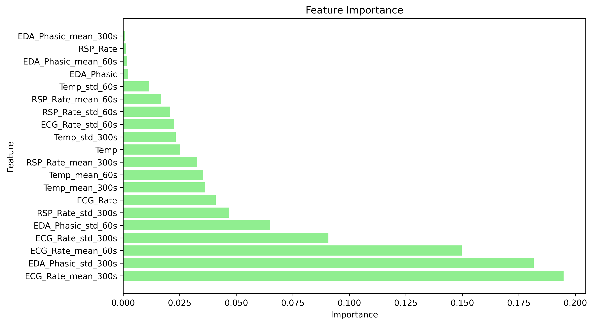

# Stress Prediction using Wearable Device Data

Introducing HealthOn, a cutting-edge wearable device that goes beyond fitness tracking to revolutionize your well-being. Our advanced sensors capture crucial physiological data such as heart rate, electrodermal activity, body temperature, and respiration rate. Leveraging the power of machine learning and data analysis, we forecast stress levels in real-time, empowering you to take proactive steps towards better mental and physical health. Our intelligent algorithms analyze the collected data, providing valuable insights into your emotional and physical states. With HealthOn, you can gain a deeper understanding of how stress impacts your life and make informed decisions to lead a happier and healthier lifestyle. Join us on this transformative journey towards improved well-being.

## Table of Contents

1. [Introduction](#introduction)
2. [Business Problem](#business-problem)
3. [File Directory](#file-directory)
4. [Data](#data)
5. [Model Evaluation](#model-evaluation)
6. [Conclusions](#conclusions)
7. [License](#license)

## Introduction

Stress prediction is important for monitoring mental health and well-being. Using wearable devices, we can gather physiological data to develop models that accurately forecast an individual's stress.

Stress can have detrimental effects on both mental and physical health. When individuals experience prolonged or chronic stress, it can contribute to various mental health disorders such as anxiety, depression, and burnout. Additionally, stress can become physical symptoms and lead to conditions such as cardiovascular diseases, gastrointestinal problems, weakened immune system, and impaired cognitive functioning. Furthermore, chronic stress can exacerbate existing health conditions and hinder the recovery process.

Recognizing the significant economic costs, high prevalence, and negative impacts on individuals, it is crucial to prioritize stress management and promote strategies that reduce stress levels.

In this project, we preprocess and analyze the WESAD dataset, extract relevant features, and apply machine learning and deep learning techniques to predict affective states. Our goal is to provide a useful models and identify important features for designers and developers of our wearable device technology to monitor and manage stress levels in real-time.

## Business Problem
HealthOn is focused on improving the health of users through the development of wearable devices. The goal is to collect and analyze physiological data in real time to provide insights and interventions to improve users health. 

Stress is a significant health related burden for individuals. It can lead to mental and somatic health issues. Changes in the body are correlated when a person is going into a stressful situation, for example, they will sweat more and their heart rate will increase.

We want to forecast if a user will be in a stressful state in the immediate future. Our device will then notify the user with recommendations to mitigate the stess.

### Project Objective

This project aims to assess the feasability of using physiological data to forecast a subject going into stress. It also aims to identify the most import features in detecting stress for the aim of improving wearable device development and design.

### Stakeholders
- Project Manager
- Business executives
- Design team

## Data

The dataset used in this project is the WESAD (Wearable Stress and Affect Detection) dataset, which is a multimodal dataset for the detection of stress using wearable physiological and motion sensors. The dataset includes data collected from various sensors placed on the subjects' chest and wrist, providing valuable information on Electrodermal Activity (EDA), Respiration (RSP), Heart Rate Variability (HRV), and other physiological signals. This section provides an overview of the dataset used for this  project. The description includes the dataset's features, labels, preprocessing steps, and the methods used to prepare the data for machine learning training.

The following data files are used in this project:

* Raw Data: [WESAD.zip](https://archive.ics.uci.edu/ml/datasets/WESAD+%28Wearable+Stress+and+Affect+Detection%29)

To repeat the preprocessing steps using the Jupyter Notebooks download the raw data file to your working directory.

### Raw dataset

* **Source**: The dataset used in this project is the [WESAD (Wearable Stress and Affect Detection) dataset](https://archive.ics.uci.edu/ml/datasets/WESAD+%28Wearable+Stress+and+Affect+Detection%29), a publicly available dataset for wearable stress and affect detection.
* **Subjects**: The dataset contains data from 15 subjects with varying demographics, including age, gender, and handedness.
* **Features**: Features are extracted using the neurokit2 python library
* **Labels**: The processed dataset contains binary labels representing stress (1) and non-stress (0) states.

### Labels

The dataset includes labels indicating the stress level of the subjects during the experiment. The labels are as follows:

- 0: No stress
- 1: Stress

### Features

The following features are available from the raw data:

- Chest data:
  - Accelerometer (ACC)
  - Electrocardiogram (ECG)
  - Electromyogram (EMG)
  - Electrodermal Activity (EDA)
  - Temperature (Temp)
  - Respiration (Resp)

- Wrist data:
  - Blood Volume Pulse (BVP)
  - Electrodermal Activity (EDA)
  - Temperature (TEMP)

#### Feature Selection
* Data Preparation: Used the NeuroKit library to preprocess and clean the physiological data. The bio_process() function in NeuroKit allows the  automated processing of different signals, such as heart beat (ECG), respiration (RSP), electrodermal activity (EDA), and electromyography (EMG). This step involved removing noise, filtering the signals, and extracting relevant features.

* Physiological Feature Extraction: With Neurokit various physiological features from the preprocessed data was extracted. Obtained features such as heart rate, R peaks indexes, respiration rate, amplitude, tonic and phasic components of EDA. These features provide valuable insights into the individual's physiological state. The image below shows the phasic signal extracted from the raw data of the first subject. The dotted red line indicates when the stress is put on the subject.

* Statistical Feature Extraction: In addition to physiological features, statistical features from the processed data was extracted. This step involved calculating statistical measures such as the median and standard deviation over 1 and 5 minute intervals. These statistical features help capture the distribution and variability of the data, providing further insights into the individual's physiological profile.

### Preprocessing

The following preprocessing steps are performed on the raw data:

1. Import the raw data from pickle files and store them as `SubjectData` objects using the `subject_data_import` function.
2. Clean and process the raw data using the [Neurokit2](https://github.com/neuropsychology/NeuroKit) library. The processing includes filtering, finding peaks, and other necessary steps to prepare the data for further analysis and model training.
3. Selected differentiable features based on graphical analysis
4. **Standardization**: The data was normalized using the `StandardScaler` from the `sklearn.preprocessing` library. The scaler was applied to the computed features for each subject.
5. **Train-test split and downsampling**: The data was split into training, testing, and validation sets by subject. The dataset was then downsampled to a target frequency of 4 Hz. The train-test split was performed using a 80-20 ratio, and the remaining training data was further split into training and validation sets with a 75-25 ratio.
6. **Data generators**: Data generators were created using the `TimeseriesGenerator` from the `tensorflow.keras.preprocessing.sequence` library. The generators were created for training, validation, and testing data with a sequence length of 5 minutes.

After preprocessing, the dataset is ready for model training.

## Model Evaluation

In this project, we train several machine learning and neural network models to predict stress based on the processed input features. Model 10 is an XGBoost model and model 11 is a Random Forest model. The rest are neural networks that utilize either a fully connected neural network to a complex transformer models.

Below is a table showing the testing metrics for each model.

| Model    | Recall   | F1-Score |
|----------|----------|----------|
| Model 0:Dense  | 0.98 | 0.50 |
| Model 1: Simple LSTM  | 0.99 | 0.50 |
| Model 2: Deep LSTM  | 0.99 | 0.51 |
| Model 3: LSTM Batch Normalization  | 0.69 | 0.32 |
| Model 4: CNN + LSTM  | 0.00 | 0.00 |
| Model 5: Transformer + LSTM  | 0.00 | 0.00 |
| Model 6: Bidirectional LSTM  | 0.67 | 0.44 |
| Model 7: Transformer + Deep LSTM  | 1.00 | 0.25 |
| Model 8: Transfomer + Deep LSTM 2  | 0.00 | 0.00 |
| Model 9: [TS-Transformer](https://arxiv.org/abs/2103.13790)  | 0.00 | 0.00 |
| Model 10: XGBoost  | 0.70 | 0.66 |
| Model 11: Random Forest  | 0.79 | 0.67 |

The figure below displays the features importance according to Model 11, an Random Forest Classifier.

## Conclusion

Physiological data, such as heart rate, electrodermal activity (EDA), body temperature, and respiration rate, can provide valuable insights into the emotional and physical state of a person. These physiological parameters are influenced by the autonomic nervous system, which regulates the body's response to various stimuli and can reflect changes in emotional arousal, stress levels, and physical well-being.

* Heart Rate: Heart rate is the number of times the heart beats per minute.

* Electrodermal Activity (EDA): EDA measures the electrical conductance of the skin, which is influenced by sweat gland activity. EDA is commonly used as an indicator of sympathetic nervous system activity, which is associated with emotional arousal and stress.

* Body Temperature: Body temperature can fluctuate based on environmental conditions, physical activity, and emotional states.

* Respiration Rate: Respiration rate refers to the number of breaths taken per minute. Emotional and physical states can impact respiration patterns.

Machine learning algorithms and statistical techniques can be applied to these data to develop models that predict emotional states, stress levels, or physical conditions, such as stress forecasting.

Based on the F1-score for the stress case, the best model to forecast if a person will be in a stressful state in the next 5 minutes is with model 11 using a Random Forest Classifier. The performance of this model is not suitable to put into production. This may be attributed to the limited dataset used for training. To build more robust and accurate stress prediction models, a larger and more diverse dataset is necessary. This would involve collecting data from a broader range of individuals, encompassing various stress-inducing situations and conditions.

To gather more data, our next generation of wearable devices should be equipped with appropriate sensors to measure physiological features identfied as important features in model 11, such as like respiration rate, electrodermal activity (EDA), heart rate, and body temperature. These sensors can provide a more comprehensive and reliable set of inputs for stress prediction models. The user can indicate on the device if they are experiencing stress and that data can be used for further training. Also the device can predict if a user is in stress or will be in stress and ask for the user's feedback on their stressful state. By incorporating additional features with high causal relationships to stress, the models can potentially improve in their ability to accurately forecast stress.

In summary, while the results from Model 10 and Model 0 indicate the feasibility of stress prediction, their limited performance and the need for a larger dataset suggest that they are not appropriate for deployment in production. Expanding the dataset and developing devices with suitable sensors would be crucial steps in enhancing the accuracy and reliability of stress prediction models.

## Recommendations
1. Enhance Feature Measurement: In order to improve the accuracy of stress forecasting, it is recommended to focus on measuring physiological features that have a high causality with stress. Specifically, consider incorporating measurements such as respiration rate, heart rate variability, body temperature, and electrodermal activity. These features have been found to be closely linked to stress responses and can provide valuable insights for stress prediction models.

2. Expand Data Collection: To further improve the forecasting models, it is crucial to gather a more diverse and comprehensive dataset. Collecting data from a larger sample size of individuals, particularly in both stressful and normal conditions, will allow for a better understanding of the variations and patterns associated with stress. Encourage voluntary data collection from users, ensuring privacy and consent, to increase the dataset's size and diversity.

3. Focus on Stressful Conditions: To specifically address stress forecasting, it is important to prioritize data collection during high-stress situations or events. This can be achieved by designing studies or collecting data from individuals undergoing stressful experiences, such as work-related stress, performance anxiety, or challenging life events. This targeted data collection will help train the models to better identify and predict stress states accurately.

4. Continuous Model Improvement: As stress forecasting is a complex task, it is essential to continuously refine and enhance the machine learning models. Regularly analyze the performance of the models, identify areas for improvement, and iterate on the algorithms and techniques used. As more data becomes available and the models evolve, periodically reassess their performance and implement necessary updates.

## File Directory
* [/deliverables](../deliverables)
* [/img](../img)
* [/notebooks](../notebooks)

## License

This project is licensed under the MIT License. See the [LICENSE](LICENSE) file for details.
